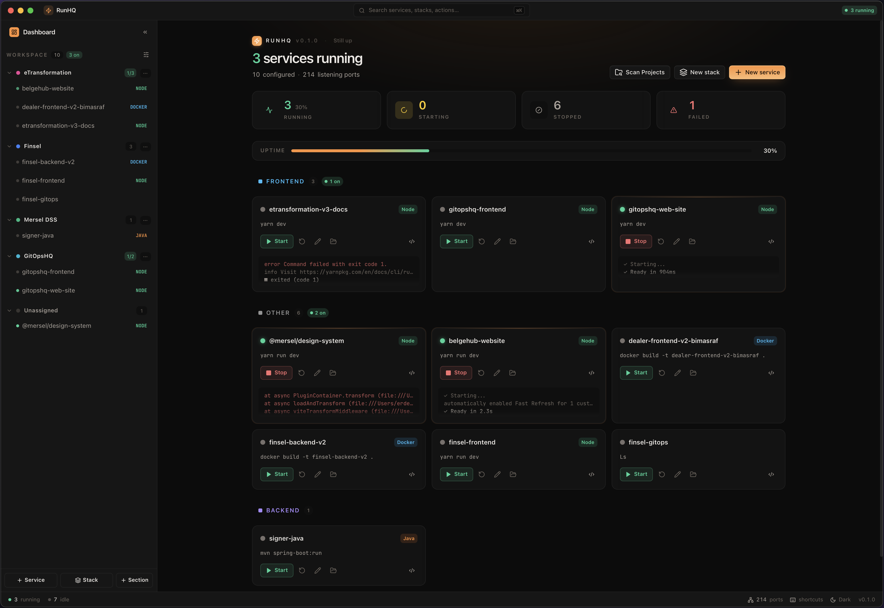

<p align="center">
  
</p>

<h1 align="center">RunHQ</h1>
<p align="center">
  <b>The universal local service orchestrator.</b><br />
  Native dev processes — Node, Go, .NET, Python, Java, Rust, Ruby, PHP, Docker — with one UI, one port watchdog, embedded terminal, and unified logs.
</p>

<p align="center">
  <a href="./LICENSE"></a>
  
  
</p>

<p align="center">
  <a href="https://runhq.dev/">
    
  </a>
</p>

---

## Why?

Terminal tabs are a mess. Containers are heavy. You open a terminal for the web app, another for the API, a third for the worker, a fourth for the database container, then you `lsof -i :3000` because something is still holding the port. RunHQ replaces that ritual with a single always-open control panel — without forcing your code into Docker.

- **Native, not containerized.** Your project runs exactly the way you already run it.
- **Local, private, offline.** No telemetry, no cloud sync, no account.
- **One window to rule them.** Start / stop / restart, kill ports, search logs, in one place.

## Features

### Core

- **Smart project auto-discovery** with 10 runtime providers: Node / Bun / Deno, .NET, Java (Maven & Gradle), Go, Rust, Python, Ruby, PHP, Docker.
- **Process supervisor** with multi-command support and graceful shutdown (SIGTERM → grace → SIGKILL).
- **Unified log stream** with bounded ring buffers (10 k lines) and virtualized rendering.
- **Real-time port watchdog** — list all TCP listeners, search, one-click **Kill port**.
- **Atomic, human-readable JSON config** at `~/.runhq/config.json`.

### Desktop UI

- **Dashboard** with system health bar, service cards, and category grouping (frontend / backend / database / infra / worker / tooling).
- **Embedded terminal** — full PTY via xterm.js with Nerd Font support and theme-aware rendering.
- **Quick Action floating window** — press <kbd>Cmd</kbd>+<kbd>Shift</kbd>+<kbd>K</kbd> to start/stop services without leaving your editor.
- **Command palette** (<kbd>Cmd</kbd>+<kbd>K</kbd>) with fuzzy search, drill-down into service commands, and favorites.
- **Editor integration** — detect and open projects in VS Code, Cursor, Windsurf, Zed, Sublime, WebStorm, IDEA, Neovim.
- **Category & runtime filters** — narrow the service list by category or runtime at a glance.
- **Auto-update** — in-app update banner with one-click "Update & Restart".
- **System tray** — close hides to tray; quit from tray menu.

## Install

### Homebrew (macOS) — recommended

```bash
brew tap erdembas/runhq
brew install --cask runhq
```

Upgrade later with `brew upgrade --cask runhq`. The cask clears macOS's quarantine attribute automatically on install, so RunHQ opens on first launch with no warnings or terminal tricks.

### Download from GitHub Releases

Grab a pre-built binary for your platform from the [latest release](https://github.com/erdembas/runhq/releases/latest):

- **macOS** — `RunHQ_<version>_aarch64.dmg` (Apple Silicon) or `RunHQ_<version>_x64.dmg` (Intel)
- **Linux** — `runhq_<version>_amd64.deb` or `runhq_<version>_amd64.AppImage`
- **Windows** — `RunHQ_<version>_x64-setup.exe` (installer) or `RunHQ_<version>_x64_en-US.msi`

The app auto-updates in place — you only need to download manually once.

> **macOS direct-DMG first launch:** because RunHQ is ad-hoc signed rather than notarized with an
> Apple Developer ID, double-clicking the app will show _"RunHQ can't be opened because it is
> from an unidentified developer"_. Either right-click → **Open** once, or run this one-liner to
> skip the Gatekeeper check entirely:
>
> ```bash
> xattr -cr /Applications/RunHQ.app
> ```
>
> `brew install --cask runhq` does this for you — recommended if you prefer zero friction.

### Build from source

See the [Development](#development) section below.

## Repository layout

```
runhq/
├── apps/
│   └── desktop/              # React UI + Tauri shell
│       ├── src/              # Frontend (React + Vite + Tailwind + xterm.js)
│       ├── src-tauri/        # Tauri wiring: IPC commands, PTY manager, tray
│       ├── tsconfig.json
│       └── vite.config.ts
├── crates/
│   └── runhq-core/       # Headless Rust core (no Tauri dep)
│       ├── src/              # Domain: supervisor, logs, ports, scanner, editors, state
│       └── tests/            # Integration tests
├── docs/
├── scripts/                  # Distribution helpers (Homebrew cask, winget, icons)
├── Cargo.toml                # Rust workspace
├── pnpm-workspace.yaml       # pnpm workspace
└── package.json              # Workspace root
```

The core crate knows nothing about Tauri. It will eventually power a `RunHQ` CLI too.

## Development

### Prerequisites

Core toolchain (all platforms):

| Tool                | Version                              | How to get it                                                                                                    |
| ------------------- | ------------------------------------ | ---------------------------------------------------------------------------------------------------------------- |
| **Node.js**         | ≥ 22                                 | [nodejs.org](https://nodejs.org/) or [nvm](https://github.com/nvm-sh/nvm) / [fnm](https://github.com/Schniz/fnm) |
| **pnpm**            | 9.14.4 (pinned via `packageManager`) | `corepack enable && corepack prepare pnpm@9.14.4 --activate`                                                     |
| **Rust**            | stable (latest)                      | [rustup.rs](https://rustup.rs/)                                                                                  |
| **Rust components** | `rustfmt`, `clippy`                  | `rustup component add rustfmt clippy`                                                                            |
| **Git**             | ≥ 2.30                               | system package manager                                                                                           |

Platform-specific build dependencies (needed by the Tauri shell):

#### macOS

Xcode Command Line Tools is enough:

```bash
xcode-select --install
```

#### Linux (Debian / Ubuntu)

```bash
sudo apt-get update
sudo apt-get install -y \
  libgtk-3-dev libayatana-appindicator3-dev librsvg2-dev \
  libwebkit2gtk-4.1-dev libjavascriptcoregtk-4.1-dev \
  build-essential curl wget file pkg-config libssl-dev
```

For other distros see [tauri.app/start/prerequisites](https://tauri.app/start/prerequisites/).

#### Windows

- **Microsoft Visual Studio C++ Build Tools** — install the "Desktop development with C++" workload from the [Visual Studio Installer](https://visualstudio.microsoft.com/visual-cpp-build-tools/).
- **WebView2 Runtime** — pre-installed on Windows 10+; older systems can grab the [Evergreen installer](https://developer.microsoft.com/en-us/microsoft-edge/webview2/).

### First-time setup

```bash
git clone https://github.com/erdembas/runhq.git
cd runhq
pnpm install          # installs JS deps + activates Husky git hooks
```

The `pnpm install` step also compiles the workspace's TypeScript config and registers Husky hooks that format/lint staged files on every `git commit` (see [Git hooks](#git-hooks) below).

### Common tasks

```bash
pnpm tauri:dev                        # run the desktop app (hot reload)
pnpm tauri:build                      # bundle release binary for your OS

pnpm lint                             # ESLint
pnpm typecheck                        # TypeScript (all packages)
pnpm format                           # Prettier: write
pnpm format:check                     # Prettier: verify only

cargo test -p runhq-core              # core unit/integration tests
cargo clippy --all-targets -- -D warnings
cargo fmt --all
```

### Git hooks

Husky runs on every commit, enforced locally:

- **`pre-commit`** → `lint-staged`: Prettier + ESLint (`--fix`) on staged JS/TS, Prettier on staged JSON/MD/CSS/HTML, `rustfmt` on staged `.rs` files. Only staged files are touched, so it stays fast.
- **`commit-msg`** → `commitlint`: enforces [Conventional Commits](https://www.conventionalcommits.org/) so release automation can version the project correctly.

If you ever need to bypass (use sparingly), prepend `--no-verify`:

```bash
git commit --no-verify -m "wip: noodling"
```

CI still runs the full quality gate, so skipped hooks won't land broken code on `main`.

### State directory

RunHQ keeps all state under `~/.runhq/`:

```
~/.runhq/
└── config.json         # services, preferences — atomic JSON writes
```

Override with the `RUNHQ_HOME` environment variable (e.g. for tests).

## Contributing

See [CONTRIBUTING.md](./CONTRIBUTING.md). The most impactful contribution is a new runtime provider — see `crates/runhq-core/src/scanner.rs`.

## License

MIT © [Erdem Baş](https://github.com/erdembas). See [LICENSE](./LICENSE).
